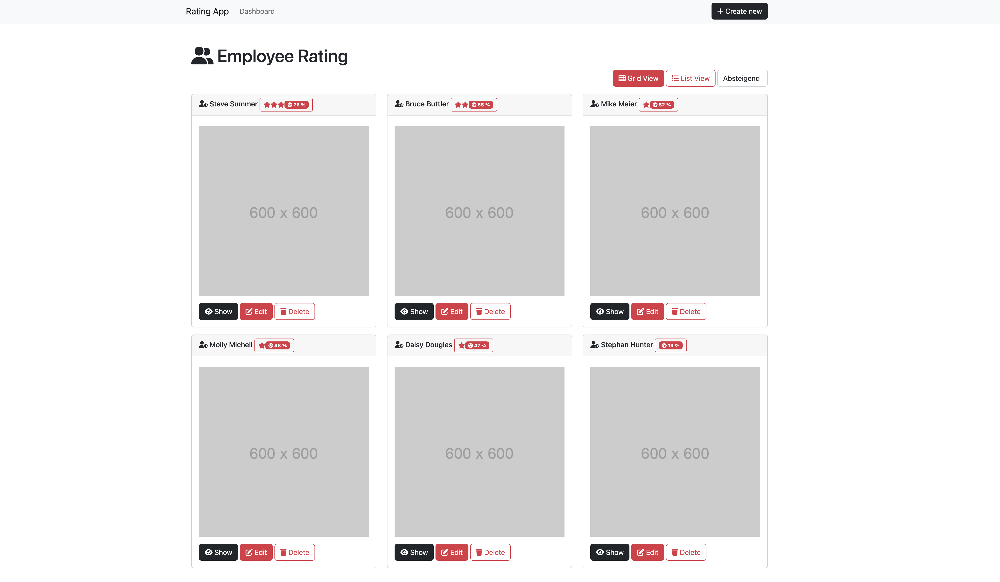
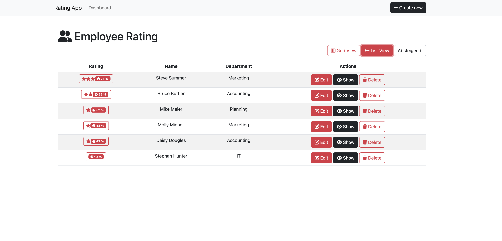

# Getting Started with React Rating App

This project was bootstrapped with [Create React App](https://github.com/facebook/create-react-app).

The frontend was build with Bootstrap 5 and Fontawesome.

## Prerequisites

```js
git clone https://github.com/bmehler/react-rating-app.git
cd react-rating-app
npm install
```

The Api is deliverd by JSON Server

```js
npm install -g json-server
cd react-rating-app
json-server --watch src/services/data/ratings.json --port 3004
```

Start the the app

```js
cd react-rating-app
npm start
```

The App is now running on http://localhost:3000


## Screenshots

### Grid View



### List View

